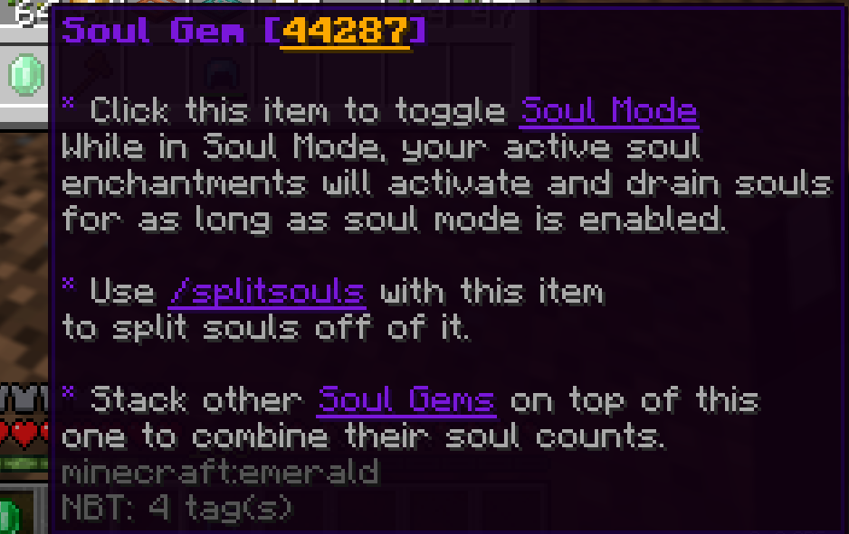

# SoulGems
A Spigot Plugin which adds right-clickable Soul Gems to the game.
The plugin is an addon for the popular custom enchantments plugin, [AdvancedEnchantments](https://www.spigotmc.org/resources/1-17-1-21-%E2%AD%95-advancedenchantments-%E2%AD%90-450-custom-enchants-%E2%AD%90create-custom-enchantments-%E2%9C%85.43058/).


This plugin was made for Spigot 1.20.4 but should be forward compatible with 1.21 and backward-compatible with 1.20.x.
It may also be compatible with earlier versions of the game, but I have not tested it.

## Download
A prebuilt version of the plugin is available in the [Releases](https://github.com/owengregson/SoulGems/releases) tab.

## Current Features
### Combine Soul Gems
Simply drag them on top of each other.
### Split Soul Gems apart
Split into smaller pieces using /splitsouls [amount] while holding a Soul Gem.
### Send Messages
You can send messages on various events with hex color code support. Send messages on: Enable, Disable, Use, Split
### Spawn Particles
Particles can be spawned on various events with configurable colors, amount, and spread. Spawn particles on: Enable, Disable, Use, Idle
### Play Sound Effects
The plugin can play sounds on various events with configurable volume and pitch. Play sounds on: Enable, Disable, Use, Split, Combine

## config.yml Preview
```yaml
settings:
  debug: false
  # Hex color codes are supported in all messages! Use <#hex> to insert them.
  splitsouls:
    cannot-split:
      - '&c&l(!)&r &cYou don''t have enough souls to do that!'
    not-a-soulgem:
      - '&c&l(!)&r &cThis item is not a soul gem!'
    usage:
      - '&7Usage: &f/splitsouls [amount]&r'
    split:
      - '&a&l(!)&r &aSoul gem has been split.'
  soul-use:
    enabled: true
    messages: # Use %amount% to insert the amount of souls used.
      - '&e&l** SOULS: &6&n&l%amount%&r&e&l **'
  soul-mode:
    enabled: true
    messages:
      enabled:
        - ' '
        - '&a&l** SOUL MODE: &nON&r&a&l **'
        - '&7Your soul enchantments will now drain souls.'
        - ' '
      disabled:
        - ' '
        - '&c&l** SOUL MODE: &nOFF&r&c&l **'
        - '&7Your soul enchantments will no longer drain souls.'
        - ' '
      empty:
        - ' '
        - '&c&l** SOUL MODE: &nOFF&r&c&l **'
        - '&7You have no soul gems left!'
        - ' '

particles:
  # Particles: https://hub.spigotmc.org/javadocs/spigot/org/bukkit/Particle.html
  y-offset: 1.0
  soul-enable:
    type: 'REDSTONE'
    colorR: 91
    colorG: 245
    colorB: 83
    amount: 20
    spread: 1.25
  soul-disable:
    type: 'REDSTONE'
    colorR: 250
    colorG: 55
    colorB: 74
    amount: 20
    spread: 1.25
  soul-idle:
    type: 'ENCHANTMENT_TABLE'
    amount: 8
    spread: 0.75
  soul-use:
    type: 'SPELL_WITCH'
    amount: 15
    spread: 0.75

sounds:
  # Sounds: https://hub.spigotmc.org/javadocs/spigot/org/bukkit/Sound.html
  # Format: SOUND:VOLUME:PITCH
  toggle-soul-mode-on:
    - 'BLOCK_RESPAWN_ANCHOR_CHARGE:1.0:0.1'
    - 'ITEM_CHORUS_FRUIT_TELEPORT:1.0:1.7'
  toggle-soul-mode-off:
    - 'BLOCK_GLASS_BREAK:1.0:0.1'
  soul-use:
    - 'ENTITY_GENERIC_EAT:10.0:1.0'
  combine-soul-gems:
    - 'ENTITY_EXPERIENCE_ORB_PICKUP:1.0:1.0'
  split-soul-gems:
    - 'BLOCK_GLASS_BREAK:1.0:1.4'
```

# Guide
I might make a guide on how to set up the development environment yourself at some point, but I am too busy right now.
The process is pretty standard for a MC plugin development environment, just set it up like you usually would and use maven to build.
The build process is dependent on the AdvancedEnchantments jar, so make sure you have that in your maven dependencies and build with it.
